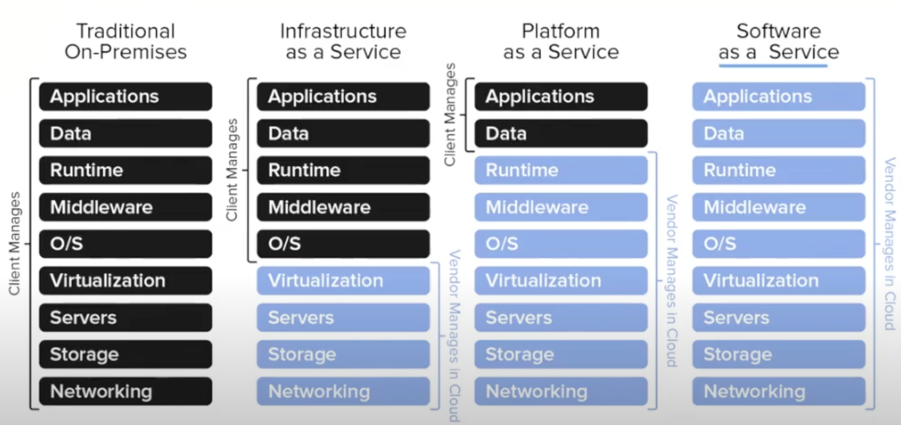

# ☁️ Cloud Computing Overview

Cloud computing provides on-demand resources like storage, networking, compute power, RAM, and CPU from a shared resource pool via the internet.

---

## 🖥️ Traditional Physical Server Setup

Setting up physical servers involves:

1. Purchasing hardware components such as CPU, RAM, storage, and networking equipment.
2. Post-usage, the hardware may become underutilized or obsolete.

---

## ☁️ Deployment Models in Cloud Computing

### 1. Public Cloud

- Accessible by multiple organizations and individual users.
- Open for everyone.
- **Example:** [AWS Public Cloud](https://aws.amazon.com/)

### 2. Private Cloud

- Dedicated infrastructure exclusively for one organization.
- Not shared with others; maintenance is the organization's responsibility.
- **Example:** [AWS Outposts](https://aws.amazon.com/outposts/) — suitable for sectors like banking that require sensitive data handling.

### 3. Hybrid Cloud

- Combines on-premises data centers with public cloud services.
- Enables communication between private and public infrastructures via VPN or Direct Connect.
- **Note:** Hybrid setups can be:
  - Public to Public
  - Data Center to Public
  - Public to Private

### 4. Community Cloud

- Shared infrastructure among a specific group of organizations.
- Used within the community for shared goals.
- **Example:** NTT Data Center

---

## 🛠️ Service Models in Cloud Computing

1. **Software as a Service (SaaS)**
   Every thing will be provided by cloud provider, you just need to use application. Starting from Servers,Storage,Network,Virtualization,OS,Middleware,Runtime,Data,Applications
   **Example:** AWS LightSail, Gmail(google provides gmail application)
2. **Platform as a Service (PaaS) **
   Cloud Provider will give us platform to run our applications.
   **Example:**
   AWS Beanstalk: It provides you the platform to run your application. example you want to create a website which is 
   (Server -> OS -> Install word press -> server creation -> public ip assign ->) upload code -> expose to outside world
3. **Infrastructure as a Service (IaaS)**
   Provides Instances
   **Example:** Elastic compute capacity(EC2)

---
